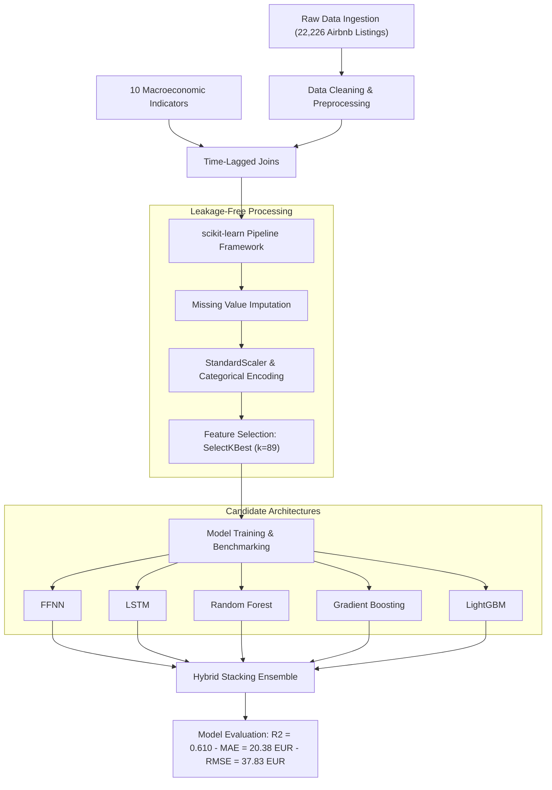

# Short-Term Rental Price Prediction in Greece Using Hybrid Machine Learning Models

> **Diploma Thesis (Integrated Master - MEng)**  
> Department of Computer Engineering & Informatics (CEID), University of Patras  
> Author: **Euaggelia Rini** 

## Project Overview
An end-to-end Machine Learning and data engineering pipeline designed to predict short-term rental (Airbnb) prices in Greece. The project addresses complex real-estate dynamics by integrating micro-level listing attributes with macroeconomic indicators through a reproducible, leakage-free processing workflow.

### Key Highlights
- **Data Ingestion & Integration:** Processed **22,226 Airbnb listings** integrated with **10 macroeconomic and socioeconomic indicators** via time-lagged joins.
- **Pipeline Architecture:** Built within a strict `scikit-learn` Pipeline framework, combining automated imputation, categorical encoding, and feature selection (`SelectKBest`, $k=89$) to eliminate data leakage.
- **Comparative Modeling:** Evaluated 6 model architectures (Feedforward Neural Networks, LSTMs, Random Forest, Gradient Boosting, LightGBM, and Hybrid Stacking Ensembles).
- **Benchmark Performance:** The **Hybrid Stacking Ensemble** achieved the best predictive accuracy:
  - **$R^2$ Score:** `0.610`
  - **MAE:** `€20.38`
  - **RMSE:** `€37.83`

## Tech Stack & Hardware
- **Core Languages & Libraries:** Python, Pandas, NumPy, scikit-learn
- **Machine Learning & Deep Learning:** LightGBM, XGBoost, TensorFlow, Keras
- **Execution Environment:** Kaggle Kernels (GPU T4×2)

## Pipeline Workflow

## Experimental Results

| Model Architecture | R² Score | MAE (€) | RMSE (€) |
| :--- | :---: | :---: | :---: |
| **Hybrid Stacking Ensemble** | **0.610** | **20.38** | **37.83** |
| LightGBM Regressor | 0.598 | 21.05 | 38.42 |
| Gradient Boosting Regressor | 0.584 | 21.60 | 39.10 |
| Random Forest Regressor | 0.579 | 21.95 | 39.40 |
| Deep Neural Network (FFNN) | 0.562 | 22.80 | 40.15 |
| Recurrent Neural Network (LSTM) | 0.548 | 23.40 | 41.20 |

> **Key Takeaway:** The multi-stage **Hybrid Stacking Ensemble** outperformed all standalone tree-based and deep learning baselines, achieving the lowest error variance and explaining **61.0% of price variance** across the Greek short-term rental market.
    
    K --> L["Model Evaluation: R2 = 0.610 - MAE = 20.38 EUR - RMSE = 37.83 EUR"]
